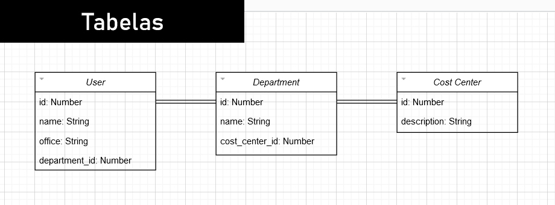
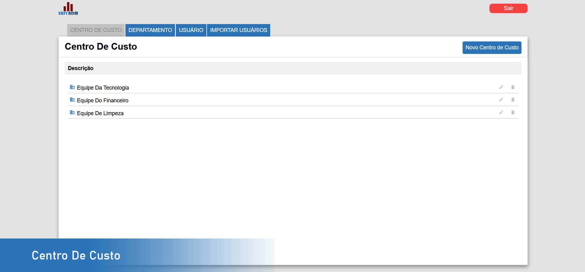
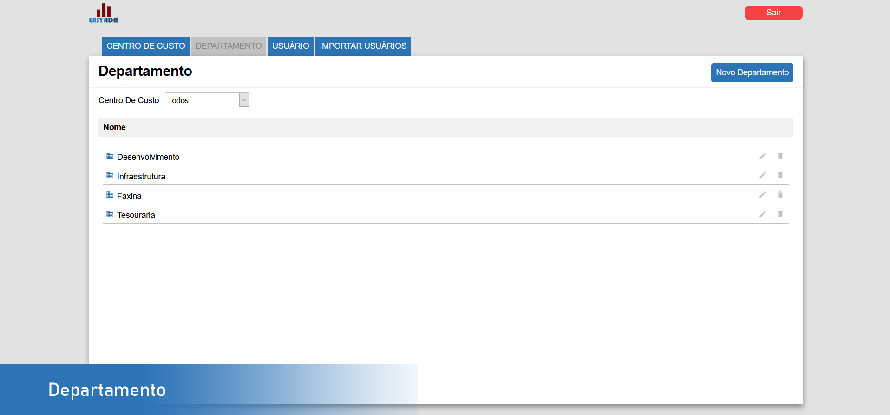
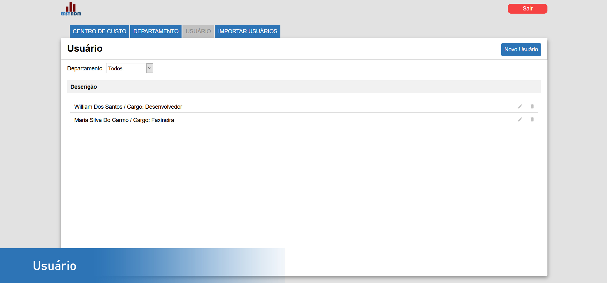
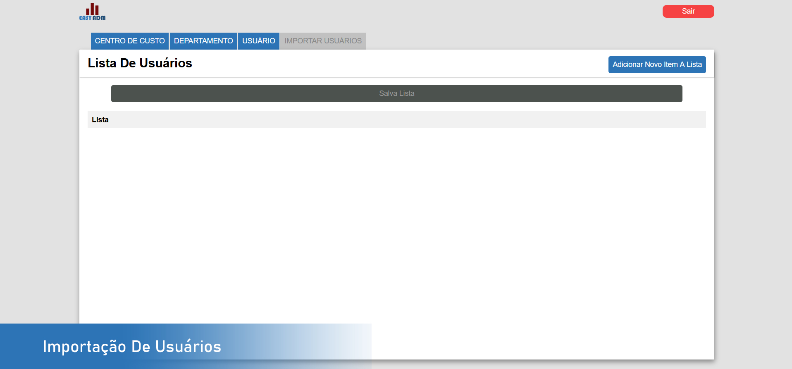

<p align="center">
  
</p>

# Easy Adm

<p align="center">
  
</p>

## Tecnologias
```
- [x] NodeJS
- [x] Express
- [x] Sqlite
- [x] Sequelize
- [x] JWT
```
```
- [x] ReactJS
- [x] Axios
- [x] Styled Components
```

## Schema Banco de Dados
<p align="center">
  
</p>

### Imagens
<p align="center">
  
</p>
<p align="center">
  
</p>
<p align="center">
  
</p>
<p align="center">
  
</p>

## Instalação
### Back-end 
```
cd backend
npx sequelize-cli db:migrate (Carregar schema das tabelas)
npm run dev
```

### Front-end (Web)
```
cd easyadm-web
npm install
npm start
```
